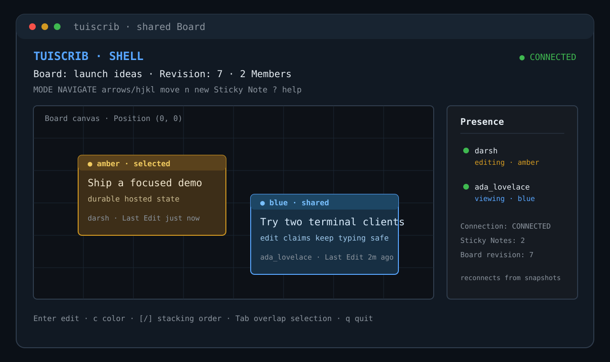

# Tuiscrib

Tuiscrib is a keyboard-first collaborative Sticky Note editor for small groups. Open two terminal clients, join the same Board, and edit or arrange notes together while the Tuiscrib Service persists the shared state.



## Try it in one minute

Clone the repository, use Bun 1.3.14, and start the terminal client:

```bash
git clone https://github.com/darshmahadevia/tuiscrib.git
cd tuiscrib
bun --version  # must report 1.3.14
bun install --frozen-lockfile
bun run dev:terminal
```

The source client connects to the hosted Tuiscrib Service at `https://tuiscrib.onrender.com` by default. Docker and PostgreSQL are not needed merely to try the client. Tuiscrib needs an 80 by 24 terminal with Unicode and 256-color support.

After the first render, press `r` to register a User, then enter a username and password twice. Press `b`, then `c` to create a Board. Press `n`, type a Sticky Note, and press Escape to publish it. Start a second `bun run dev:terminal` client, press `b`, then `j`, and enter the displayed Join Code to collaborate.

## Choose the Tuiscrib Service

A source client connects to `https://tuiscrib.onrender.com` by default. You can point it at another HTTP(S) server origin with either form:

```bash
bun run dev:terminal -- --server https://your-service.example
TUISCRIB_URL=https://your-service.example bun run dev:terminal
```

The precedence is `--server <url>` flag, then `TUISCRIB_URL`, then the hosted default. The URL must be an `http://` or `https://` origin with no credentials, path, query string, or fragment. Invalid values stop the client with a validation error. `TUISCRIB_URL` remains useful for local development, for example `http://127.0.0.1:3000`.

## Before you use it

This is a Source-First Portfolio Demo and a student passion project. Use non-sensitive data only.

- Identity is a username and password. Tuiscrib does not collect email, offer password recovery, delete identities, or export data. Losing both the password and the protected local Terminal Session credential can permanently lose access.
- The free Render and Supabase hosting may sleep, pause, restart, or lose data. There is no uptime, backup, recovery, or support guarantee.
- [GitHub Issues](https://github.com/darshmahadevia/tuiscrib/issues) is the reporting channel. There is no response-time promise or support commitment.

The hosted service is a free-tier demonstration, not a production service. It may sleep, pause, restart, or lose data; Tuiscrib has no application-managed backups, recovery workflow, monitoring guarantee, or uptime promise.

## Develop locally

The quick start above is the primary path. To run the Tuiscrib Service locally as well, install Bun 1.3.14 and Docker Desktop, then start a disposable PostgreSQL instance:

```bash
docker run --name tuiscrib-postgres \
  --publish 127.0.0.1:5432:5432 \
  --env POSTGRES_USER=postgres \
  --env POSTGRES_PASSWORD=postgres \
  --env POSTGRES_DB=tuiscrib \
  --detach postgres:16-alpine
cp .env.example .env
bun install --frozen-lockfile
bun run db:migrate
bun run dev:service
```

In another terminal, run `bun run dev:terminal` with `TUISCRIB_URL=http://127.0.0.1:3000` or pass `--server http://127.0.0.1:3000`. The full deterministic acceptance suite is `bun test`; typecheck all workspace packages with `bun run typecheck`.

The two-client journey and hosted free-tier notes are in [docs/portfolio-demo.md](docs/portfolio-demo.md). Deployment details are in [docs/deployment.md](docs/deployment.md). Optional developer-only standalone verification is documented in [docs/standalone-verification.md](docs/standalone-verification.md).

## License

Tuiscrib is released under the [MIT License](LICENSE).
